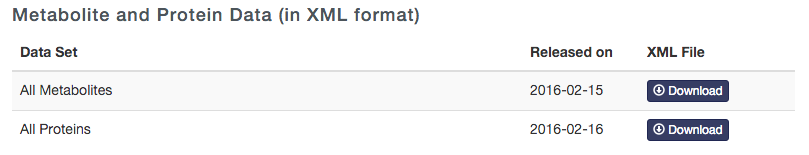

This script updates HMDB for OpenMS

It generates a HMDBMappingFile.tsv and a HMDB2StructMapping.tsv that is used by the AccurateMassSearch

#Steps to do :  
 
1. Download "**All Metabolites**" files as XML from http://www.hmdb.ca/downloads   

2. extract into folder hmdb_metabolites  
3. delete hmdb_metabolites.xml 
4. execute python scripts:  
```
python generateHMDB2StructMapping.py 
python generateHMDBMappingFile.py
```

**Note :** 
currently, there is one line that contains a UTF-8 Character, you have to edit it manually ( in the HMDB2StructMapping.tsv file)